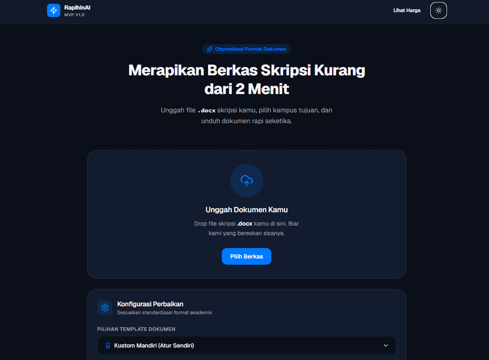
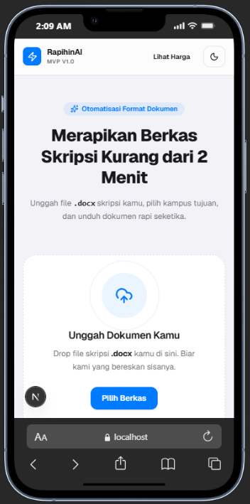

# RapihinAI

**RapihinAI** adalah aplikasi web berbasis Next.js untuk merapikan format dokumen akademik (Skripsi, Tesis, Tugas Akhir, Laporan KP) secara instan kurang dari 2 menit. 

Aplikasi ini menggunakan pendekatan *rule-based engine* murni melalui manipulasi XML berkas `.docx` secara *ephemeral* di memori RAM, sehingga menjamin privasi data mahasiswa secara 100%.

---

## 📸 Tampilan Aplikasi (UI Screenshots)

> [!TIP]
> Tempel gambar screenshot UI milikmu di bawah ini untuk mempercantik dokumentasi repositori GitHub.

### Tampilan Desktop
<!-- TEMPEL SCREENSHOT DESKTOP KAMU DI SINI -->
<!-- Contoh:  -->


### Tampilan Mobile (Responsive)
<!-- TEMPEL SCREENSHOT MOBILE KAMU DI SINI -->
<!-- Contoh:  -->


---

## 🛠️ Tech Stack

* **Frontend:** Next.js (App Router, React, TypeScript)
* **Styling:** Tailwind CSS v4 (iOS Minimalist & Clean Modern aesthetics)
* **State & Query:** TanStack Query (React Query)
* **Document Manipulation:** `mammoth` (parsing), `jszip` (modifikasi XML docx), `xmldom` (pengolahan XML DOM)
* **Database & ORM:** Prisma ORM & PostgreSQL

---

## 🚀 Fitur Utama MVP

1. **AirDrop-style Dropzone**: Area unggah berkas `.docx` interaktif dengan deteksi seret-lepas (*drag-and-drop*) dan validasi instan batas ukuran (maksimal 20MB).
2. **Template Standar Akademik (General)**: Opsi pemformatan standar universal gratis (Margin 4-3-4-3 cm, font utama Times New Roman, dan spasi baris 1.5).
3. **Kustom Mandiri (Atur Sendiri)**: Kebebasan kustomisasi ukuran margin, font, dan spasi baris secara dinamis.
4. **Pembatasan Font (Free vs Pro)**: Times New Roman dapat digunakan gratis, sedangkan font premium lain (Arial, Calibri, Georgia) terkunci eksklusif untuk tingkat Pro `(🔒 Pro)`.
5. **Dasbor Kepatuhan Format (Compliance Checker)**: Laporan detail mengenai status format saat ini (sebelum) vs format target (sesudah).
6. **Processing Modal Taktil**: Floating modal transparan dengan *progress ticker* bar pemrosesan bertahap dan unduhan berkas otomatis.

---

## 💻 Cara Menjalankan Project Secara Lokal

### 1. Kloning Repositori
```bash
git clone https://github.com/ilsetiawan1/rapihin-ai.git
cd rapihin-ai
```

### 2. Instalasi Dependensi
```bash
pnpm install
# atau
npm install
```

### 3. Jalankan Dev Server
```bash
pnpm dev
# atau
npm run dev
```

Buka [http://localhost:3000](http://localhost:3000) di browser untuk melihat hasilnya secara langsung.
