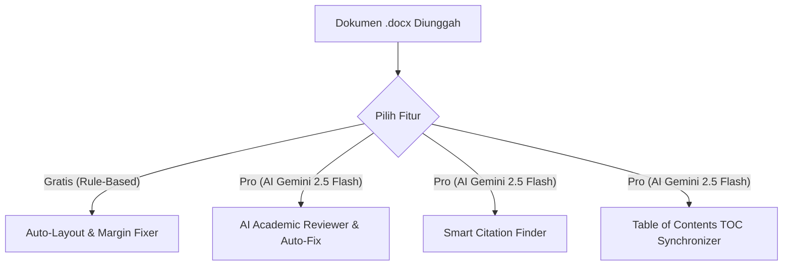

# Product Requirement Document (PRD) - RapihinAI MVP

---

## 1. Executive Summary & Goal
### Goal
Mengurangi waktu penyusunan dan perbaikan format serta kualitas konten dokumen akademik (Skripsi, Tesis, Tugas Akhir, Laporan KP) dari beberapa jam menjadi kurang dari 2 menit melalui sistem otomatisasi format instan (gratis) dan perbaikan substansi berbasis AI (berbayar).

### North Star Metric
* **North Star Metric:** Jumlah file `.docx` yang berhasil dirapikan, direview, dan diunduh oleh pengguna.
* **KPI Utama:**
  * **User Acquisition:** 500 pengguna aktif dalam 4 minggu pertama pasca rilis.
  * **Conversion Rate (Free to Pro):** Min. 5% pengguna reguler beralih ke Tier Pro dengan membeli Token.
  * **Retention Rate:** 25% pengguna melakukan *upload* ulang untuk perbaikan revisi bab baru.

---

## 2. Target User & Persona

### Target User
* **Primary:** Mahasiswa tingkat akhir (S1/S2/D3) di Indonesia yang sedang menyelesaikan tugas akhir/skripsi dan dikejar tenggat sidang/kelulusan.
* **Secondary:** Dosen pembimbing yang menginginkan format draf bimbingan mahasiswanya rapi sebelum diperiksa.

### Studi Kasus Pengguna (User Journey)
* **Nama Persona:** Budi, mahasiswa S1 tingkat akhir yang kurang paham teknis (*gaptek*) dan sering kesulitan memformat dokumen di Microsoft Word.
* **Fase Gratis (Auto-Layout & Kosmetik):** Budi menemukan RapihinAI dan mengunggah dokumen draf laporan tugas akhirnya yang berantakan. Sistem secara instan menganalisis, merapikan margin halaman (4-3-4-3 cm), dan menyamakan ukuran font utama secara gratis. Budi merasa terbantu dan senang karena layoutnya langsung presisi.
* **Fase Berbayar (Substansi Konten & Upselling):** Setelah layout kosmetiknya rapi, Budi teringat bahwa isinya masih memiliki banyak coretan revisi, kalimat tidak baku, dan typo dari dosen pembimbing. Di bawah layar hasil download, Budi melihat tawaran fitur Pro: **"Analisis & Perbaikan Konten Otomatis"** yang ditenagai AI. Agar revisinya cepat selesai, Budi bersedia masuk menggunakan akun Google (OAuth) dan membeli paket Token Pro untuk memperbaiki isi draf babnya.

---

## 3. Technology Stack

### Frontend
* **Framework:** Next.js (TypeScript, App Router)
* **Styling:** Tailwind CSS v4 (Sleek, modern iOS-style layout dengan transisi taktil)
* **Libraries:**
  * React Query / TanStack Query (manajemen state asinkronus untuk tracking status revisi & upload)
  * Mammoth.js (untuk mem-parse berkas `.docx` ke HTML sebagai preview di dalam UI)

### Backend
* **Runtime:** Node.js (Next.js Server Actions / Route Handlers)
* **Authentication:** NextAuth.js (Google OAuth login murni tanpa form ribet)
* **AI Integration:** Google Gemini 2.5 Flash API (dipilih karena kecepatan pemrosesan tinggi, hemat token, dan context window raksasa untuk file tebal)
* **Document Manipulation:** `jszip` & XML parsers (`xmldom`) untuk ekstraksi dan modifikasi mentah berkas XML OpenXML (.docx)

### Database & Storage
* **Database:** PostgreSQL + Prisma ORM (menyimpan profil user, saldo Token aktif, log histori transaksi, telemetry API, dan audit log)
* **Storage:** Ephemeral / In-Memory (file skripsi pengguna hanya diproses di RAM buffer secara instan dan tidak disimpan di disk server demi keamanan kerahasiaan akademik)

---

## 4. Fitur Utama & Pembagian Tier (MVP Scope)

### A. Tier Gratis (Rule-Based Engine)
* **Auto-Layout & Margin Fixer:** Otomatis mendeteksi dan mengubah ukuran margin halaman (atas, bawah, kiri, kanan) secara presisi sesuai preset standar akademik nasional (4-3-4-3 cm) atau input kustom secara instan.
* **Standard Font Uniformity:** Menyeragamkan seluruh jenis font isi dokumen menjadi Times New Roman (font standar akademik gratis).

### B. Tier Premium / Pro (AI-Powered Engine - Memerlukan Token & Google Login)
* **AI Academic Reviewer & Auto-Fix:** Mendeteksi kesalahan ketik (*typo*), menyusun ulang kalimat berbelit-belit, dan mengubah kata tidak baku menjadi format standar akademis (KBBI/PUEBI) secara otomatis pada teks asli tanpa merusak struktur paragraph/tabel.
* **Smart Citation Finder:** Membaca konteks teks, mendeteksi klaim yang membutuhkan sitasi ilmiah, lalu mencari dan merekomendasikan artikel jurnal ilmiah nasional/internasional yang relevan.
* **Table of Contents (TOC) Synchronizer:** Menganalisis inkonsistensi nomor halaman pada Daftar Isi (TOC) dengan posisi riil Bab/Sub-bab di dalam dokumen skripsi, lalu memperbaikinya secara otomatis.

### C. Panel Administrasi (CMS Admin / Backoffice)
Untuk penanganan operasional internal dan customer support, sistem menyediakan area administrasi backoffice dengan fungsionalitas:
1. **Dasbor Metrik Ringkas:** Memantau metrik bisnis utama secara real-time, seperti jumlah total pengguna baru terdaftar dan jumlah dokumen yang berhasil diproses (North Star Metric).
2. **Manajemen User & Token:** Memungkinkan Admin untuk melakukan pencarian profil pengguna menggunakan alamat email, serta menambah atau mengurangi saldo token mereka secara manual (untuk kebutuhan refund, kompensasi gangguan teknis, atau gift token).
3. **Manajemen Template Preset:** Mengaktifkan atau menonaktifkan preset pedoman kampus secara dinamis dari database agar daftar pilihan template di sisi user tetap up-to-date.

---

## 5. Monetisasi & Token-Based System
1. **Google OAuth Gateway:** User dapat mengakses fitur dasar gratis tanpa login. Namun untuk mencoba fitur Pro atau melihat hasil analisis AI, user wajib masuk menggunakan Google Login sekali klik.
2. **Sistem Saldo Token:**
   * Setiap pengguna baru yang mendaftar via Google OAuth akan mendapatkan bonus kuota awal gratis (e.g., 5 Token).
   * Fitur Pro memotong saldo token sesuai kompleksitas pekerjaan (misal: 1 Token per perbaikan bab, atau 1 Token per sinkronisasi TOC).
   * Pengguna dapat membeli isi ulang (*top-up*) paket Token melalui payment gateway yang terintegrasi di UI.

---

## 6. User Flow MVP
1. **Landing & Upload**: Pengguna mengunjungi landing page RapihinAI dan menjatuhkan file `.docx` pada dropzone interaktif.
2. **Format Analyzer**: Sistem langsung menganalisis format kosmetik (margin & font) secara lokal dan menampilkan checklist ketidaksesuaian di *Compliance Panel*.
3. **Free Formatting Run**: Pengguna menekan tombol "Rapikan Dokumen" untuk menerapkan perbaikan margin & font standar akademik secara gratis, lalu mengunduh hasilnya.
4. **Pro Promotion & Login**: Di bagian hasil perbaikan, dasbor menampilkan penawaran "Revisi Konten oleh AI (Perbaikan Typo & Kalimat Baku)". Pengguna menekan tombol dan diarahkan untuk Google Login (jika belum masuk).
5. **Token Execution**: Pengguna memilih fitur AI (Academic Reviewer, Citation Finder, atau TOC Sync). Sistem memotong saldo Token, memanggil API Gemini 2.5 Flash, memproses berkas, dan memicu unduhan file hasil revisi AI secara otomatis.

---

## 7. Data Privacy & Security Guardrails
* **Kerahasiaan Dokumen:** File tidak disimpan secara permanen di storage fisik mana pun. Dokumen diurai di memori RAM, diproses melalui API Gemini secara terenkripsi (VPC/SSL), dan langsung dihapus setelah file di-stream kembali ke browser pengguna.
* **Preservasi Format XML:** Sistem memastikan bahwa proses manipulasi teks oleh AI tidak merusak tag formatting internal Word (`w:rPr`, `w:pPr`, link, gambar, dan tabel) dengan mem-parse text secara selektif per-*run element*.
