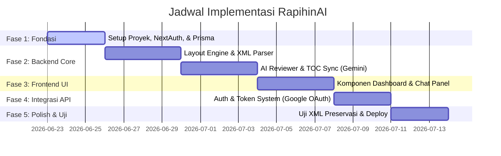

# Development Roadmap - RapihinAI MVP

Roadmap ini disusun berdasarkan prioritas pengerjaan guna memastikan integrasi yang lancar antara UI/UX di sisi Frontend, sistem otentikasi Google OAuth, dan *AI Core Processing Engine* (Gemini 2.5 Flash).

---

## Ringkasan Fase Pengerjaan

---

## 🚀 Rincian Fase Pengerjaan

### Fase 1: Inisialisasi & Setup Fondasi (Foundation Setup)
* **Goal:** Menyiapkan dependensi, NextAuth, schema database PostgreSQL, dan boilerplate Next.js.
* **Tugas:**
  1. **NPM Packages Installation:**
     * File Parsing: `npm i mammoth jszip xmldom`
     * State & API: `npm i @tanstack/react-query`
     * Database: `npm i @prisma/client` & `npm i -D prisma`
     * Auth: `npm i next-auth`
     * AI: `npm i ai @ai-sdk/google`
  2. **Tailwind CSS v4 Configuration:** Konfigurasi variabel tema di global CSS (zinc, accent blue, border-radius, font-sans).
  3. **Database & NextAuth Init:**
     * Setup `prisma/schema.prisma` sesuai dengan skema otentikasi standard NextAuth + field `User.tokens`.
     * Jalankan migrasi awal: `npx prisma migrate dev --name init`.
  4. **Providers Integration:** Setup `<SessionProvider>` NextAuth dan `<QueryClientProvider>` React Query di `app/layout.tsx`.

---

### Fase 2: Backend Core Engine Development (Otak Aplikasi)
* **Goal:** Membuat modul pemformatan berkas biner `.docx` murni (Rule-Based) dan modul AI (Gemini 2.5 Flash).
* **Tugas:**
  1. **XML Layout Formatter (`services/formatter/docx-formatter.ts`):**
     * Bongkar berkas zip `.docx` di memori menggunakan `jszip`.
     * Terapkan DOM manipulation (`xmldom`) untuk menimpa nilai margin (`w:pgMar`), font (`w:rFonts`), dan spasi (`w:spacing`) pada XML.
  2. **AI Academic Reviewer (Gemini Integration):**
     * Setup route `/api/chat` menggunakan SDK Vercel AI dengan model `gemini-2.5-flash`.
     * Buat skrip ekstraksi run element teks (`<w:t>`) secara selektif agar gaya tulisan tidak hilang saat AI mengganti teks.
  3. **TOC Synchronizer Logic:**
     * Buat pemindai posisi bab dan sub-bab menggunakan regex.
     * Buat algoritma estimasi nomor halaman, kemudian perbarui XML Daftar Isi dokumen.

---

### Fase 3: Frontend UI Components (iOS Style Interface)
* **Goal:** Membangun antarmuka pengguna berbasis Next.js Client Component dengan visual minimalis premium.
* **Tugas:**
  1. **Unified Dashboard Layout (`app/page.tsx`):**
     * Hubungkan `Sidebar` (untuk riwayat aktivitas) dan `Header` utama.
     * Sediakan tombol *Theme Toggle* gelap/terang.
  2. **AI Chat Panel (`components/features/ChatPanel.tsx`):**
     * Buat interface chat asisten AI interaktif dengan status online pulse, quick action button, dan area upload dokumen.
  3. **Compliance Report Card (`components/features/CompliancePanel.tsx`):**
     * Rancang visual status kepatuhan margin, font, dan bab dokumen setelah file di-parse secara instan.

---

### Fase 4: Autentikasi, API Routes, & Monetisasi Token
* **Goal:** Menghubungkan frontend-backend secara aman dengan autentikasi Google OAuth dan sistem saldo Token.
* **Tugas:**
  1. **Google OAuth Gateway:**
     * Integrasikan NextAuth API handler di `/api/auth/[...nextauth]/route.ts`.
     * Batasi akses fitur premium AI (Academic Reviewer, Citation Finder, TOC Sync) wajib login terlebih dahulu.
  2. **Token Management & Billing API:**
     * Implementasikan pemotongan Token di database saat fitur Pro berhasil dijalankan.
     * Buat visual modal pengisian saldo Token (`PricingModal.tsx`) di UI.
  3. **API Integration & File Download:**
     * Hubungkan React Query mutation (`useFormatDocument`) ke `/api/process-document`.
     * Terapkan trigger download native browser saat respon biner dikembalikan secara aman.

---

### Fase 5: Uji Coba, Keamanan, & Deployment (Testing & Polish)
* **Goal:** Menguji kinerja formatting pada file nyata, preservasi tag XML, dan rilis ke produksi.
* **Tugas:**
  1. **XML Integrity Verification:**
     * Uji dokumen skripsi asli dengan tabel, gambar, sitasi Mendeley, dan rumus matematika.
     * Pastikan format internal Microsoft Word tidak corrupt pasca manipulasi XML.
  2. **Security Audit:**
     * Pastikan pemrosesan file murni ephemeral (in-memory buffer) tanpa jejak file di server hosting.
  3. **Production Deployment:**
     * Hubungkan ke Vercel/Netlify dengan setup environment variables (`DATABASE_URL`, `GOOGLE_CLIENT_ID`, `GOOGLE_CLIENT_SECRET`, `GEMINI_API_KEY`, `NEXTAUTH_SECRET`).
