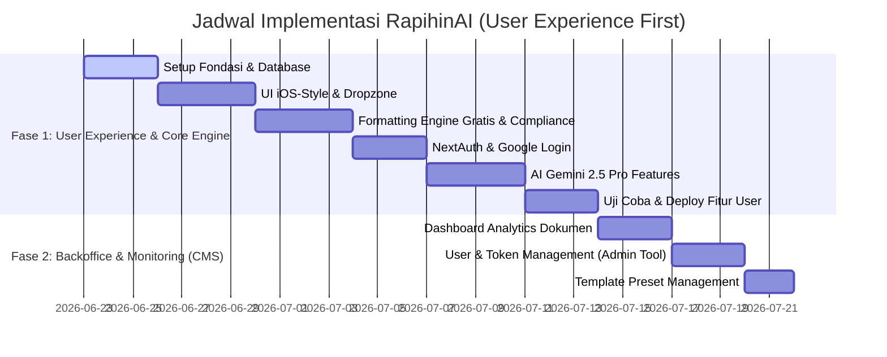

# Development Roadmap - RapihinAI MVP

Roadmap ini disusun menggunakan pendekatan **"User Experience First"**. Fokus utama adalah menyelesaikan seluruh fungsionalitas dan antarmuka pengguna (termasuk fitur gratis dan Pro) hingga stabil dan dideploy, baru kemudian membangun panel administrasi / CMS Backoffice untuk manajemen internal.

---

## Ringkasan Fase Pengerjaan

---

## 🚀 Rincian Fase Pengerjaan

### Fase 1: User Experience & Core Engine (Prioritas Utama)

Fase ini bertujuan untuk menyelesaikan seluruh pengalaman pengguna dari ujung ke ujung, mulai dari landing page hingga pengunduhan hasil revisi AI.

#### 1. Inisialisasi & Setup Fondasi (Foundation Setup)
* **Goal:** Menyiapkan dependensi, NextAuth, schema database PostgreSQL, dan boilerplate Next.js.
* **Tugas:**
  * **NPM Packages Installation:** `npm i mammoth jszip xmldom @tanstack/react-query @prisma/client next-auth ai @ai-sdk/google` (dan development dependencies seperti `prisma`).
  * **Tailwind CSS v4 Configuration:** Konfigurasi variabel tema di global CSS (zinc, accent blue, border-radius, font-sans).
  * **Database Init:** Setup skema Prisma PostgreSQL (`DATABASE.md`) dan jalankan migrasi awal (`npx prisma migrate dev --name init`).
  * **Providers Integration:** Setup `<SessionProvider>` NextAuth dan `<QueryClientProvider>` React Query di `app/layout.tsx`.

#### 2. Frontend UI Components (iOS Style Interface)
* **Goal:** Membangun antarmuka pengguna berbasis Next.js Client Component dengan visual minimalis premium ala iOS.
* **Tugas:**
  * **Unified Dashboard Layout (`app/page.tsx`):** Integrasi `Sidebar` (riwayat aktivitas), `Header` utama, dan tombol *Theme Toggle* (gelap/terang).
  * **AI Chat Panel (`components/features/ChatPanel.tsx`):** Antarmuka chat asisten AI interaktif dengan status online pulse, quick action button, dan area upload dokumen.
  * **Compliance Report Card (`components/features/CompliancePanel.tsx`):** Visual status kepatuhan margin, font, dan bab dokumen setelah file di-parse secara instan.

#### 3. Formatting Engine Gratis (Rule-Based) & Compliance Parser
* **Goal:** Implementasi pemformatan margin/font/spasi gratis serta analisis kepatuhan dokumen.
* **Tugas:**
  * **XML Layout Formatter (`services/formatter/docx-formatter.ts`):** Mengurai ZIP `.docx` via `jszip` dan memanipulasi node XML (`w:pgMar`, `w:rFonts`, `w:spacing`) via `xmldom`.
  * **Compliance Parser:** Mengurai draf skripsi secara instan menggunakan `mammoth.js` dan regex terstruktur untuk memvalidasi struktur Bab.

#### 4. Autentikasi NextAuth & Google Login
* **Goal:** Memungkinkan integrasi login satu klik menggunakan akun Google untuk mengakses fitur Pro.
* **Tugas:**
  * **Google OAuth Gateway:** Integrasikan NextAuth API handler di `/api/auth/[...nextauth]/route.ts`.
  * **Route Protection:** Batasi akses fitur premium AI (Academic Reviewer, Citation Finder, TOC Sync) bagi pengguna non-login.

#### 5. Integrasi Fitur AI Pro (Gemini 2.5 Flash) & Token-Based System
* **Goal:** Menghubungkan asisten AI ke dokumen untuk perbaikan teks dan sinkronisasi Daftar Isi.
* **Tugas:**
  * **AI Academic Reviewer:** Mengirimkan run-element teks (`<w:t>`) ke Gemini untuk perbaikan typo dan tata bahasa baku tanpa merusak format style Word.
  * **TOC Synchronizer:** Pindai lokasi bab, estimasikan halaman, dan update data nomor halaman Daftar Isi di dalam XML.
  * **Token System:** Implementasikan logika pemotongan Token di database saat fitur Pro berhasil dijalankan.

#### 6. Uji Coba, Keamanan & Deployment Fitur User
* **Goal:** Verifikasi stabilitas format dokumen dan rilis ke produksi.
* **Tugas:**
  * **XML Integrity Verification:** Uji dengan berkas skripsi asli yang berisi tabel, gambar, dan sitasi untuk menjamin file tidak corrupt.
  * **Vercel/Netlify Deploy:** Hubungkan repo GitHub ke hosting dan setup environment variables.

---

### Fase 2: Backoffice & Monitoring (CMS Admin)

Dikerjakan secara menyeluruh setelah seluruh fitur pengguna di Fase 1 berjalan dengan stabil dan bebas dari bug.

#### 1. Dashboard Analytics Dokumen
* **Goal:** Menyediakan dasbor statistik internal bagi administrator untuk memantau performa bisnis dan operasional.
* **Tugas:**
  * **Visualisasi Metrik:** Rancang grafik tren harian total pengguna baru, jumlah file yang diproses (North Star Metric), rata-rata durasi pemrosesan, dan rasio sukses.
  * **Audit Logging:** Halaman log aktivitas backend untuk memantau error pemrosesan file atau kegagalan API.

#### 2. Management User & Token (Internal Admin Tool)
* **Goal:** Memungkinkan administrator mencari user dan menyesuaikan saldo token secara manual.
* **Tugas:**
  * **Search & Filter:** Form pencarian pengguna berdasarkan alamat email atau nama.
  * **Manipulasi Saldo Token:** Aksi admin (Button tambah/kurang token) dengan verifikasi log audit transaksi untuk kebutuhan customer support, refund, atau pemberian bonus khusus.

#### 3. Template Preset Management
* **Goal:** Mengelola preset format kampus tanpa harus mengubah kode backend secara manual.
* **Tugas:**
  * **Dynamic Toggle:** Menyediakan tabel berisi preset format kampus (standard akademik, preset kampus tertentu) dengan opsi untuk mengaktifkan/menonaktifkan preset kampus tersebut secara dinamis dari database.
