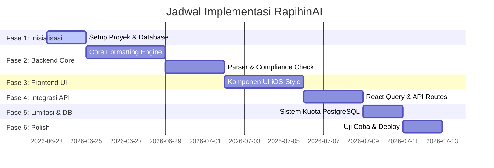

# Development Roadmap - RapihinAI / ThesisFlow AI
## Panduan Fase Implementasi: Dari Frontend ke Backend

Roadmap ini disusun berdasarkan prioritas pengerjaan guna memastikan integrasi yang lancar antara UI/UX di sisi Frontend dan *Core Processing Engine* di sisi Backend.

---

## Ringkasan Fase Pengerjaan

---

## 🚀 Rincian Fase Pengerjaan

### Fase 1: Inisialisasi & Setup Fondasi (Foundation Setup)
* **Goal:** Menyiapkan dependensi, struktur database, dan boilerplate Next.js.
* **Tugas:**
  1. **Instalasi NPM Packages:**
     - Pemformatan: `npm i mammoth jszip xmldom`
     - State & Fetching: `npm i @tanstack/react-query`
     - Database: `npm i @prisma/client` & `npm i -D prisma`
  2. **Konfigurasi Tailwind CSS v4:** Setup variabel warna di global CSS (misal: zinc, accent blue, border-radius).
  3. **Inisialisasi Database:**
     - Jalankan `npx prisma init`.
     - Konfigurasi schema database PostgreSQL sesuai dengan `schema.prisma` yang ada di TRD.
     - Lakukan migrasi awal: `npx prisma migrate dev --name init`.
  4. **Setup Query Provider:** Bungkus Root Layout (`app/layout.tsx`) dengan React Query Client Provider.

---

### Fase 2: Backend Core Engine Development (Otak Aplikasi)
* **Goal:** Membuat fungsi pemroses dokumen biner `.docx` murni di sisi backend.
* **Tugas:**
  1. **Pembuatan Document Parser (`services/parser/compliance.ts`):**
     - Gunakan `mammoth.js` untuk mengekstrak plain text.
     - Implementasikan Regex pencocokan Bab (`BAB I`, `BAB II`), Sub-bab (`1.1 Latar Belakang`), dan Daftar Pustaka.
  2. **Pembuatan XML Formatter (`services/formatter/docx-formatter.ts`):**
     - Gunakan `jszip` untuk mengurai struktur berkas `.docx` (zip).
     - Implementasikan pencarian file `word/document.xml` dan file-file di folder `word/theme/` atau `word/styles.xml`.
     - Buat fungsi override DOM XML untuk properti margin (`w:pgMar`), font family (`w:rFonts`), dan line spacing (`w:spacing`).
     - Terapkan rumus konversi cm ke Twips ($1\text{ cm} = 567\text{ twips}$).
  3. **Pengemasan Kembali (.docx Pack):**
     - Compile kembali XML yang telah di-override ke format zip biner `.docx`.

---

### Fase 3: Frontend UI Components (Penyusunan Antarmuka)
* **Goal:** Membangun antarmuka pengguna berbasis Next.js Client Component dengan visual minimalis ala iOS.
* **Tugas:**
  1. **Desain Dropzone ala AirDrop (`components/features/Dropzone.tsx`):**
     - Implementasi drag-and-drop file API bawaan HTML5.
     - Tambahkan animasi scale-up dan hover state yang empuk menggunakan CSS/Tailwind transitions.
     - Atur validasi tipe file (.docx saja) dan limit ukuran file (20MB) di tingkat client.
  2. **Desain Form Parameter / Template Selector (`components/features/TemplateSelector.tsx`):**
     - Buat form input parameter (margin, font, spasi) dengan opsi template preset standar akademik umum dan konfigurasi kustom.
  3. **Desain Panel Dasbor Kepatuhan (`components/features/CompliancePanel.tsx`):**
     - Tampilan informasi setelah berkas diunggah, menampilkan checklist format mana yang benar (hijau) dan yang salah (merah).

---

### Fase 4: Integrasi API & React Query Hooks
* **Goal:** Menghubungkan Frontend dan Backend secara asinkronus menggunakan API Routes Next.js.
* **Tugas:**
  1. **Pembuatan Route Handlers (`app/api/`):**
     - `GET /api/templates` untuk menyajikan preset template dokumen standar.
     - `POST /api/format` untuk memproses file `.docx` biner.
  2. **Pembuatan Custom Hooks (`hooks/`):**
     - `useTemplates` dengan `useQuery` dari React Query untuk mengambil data template standar secara cached.
     - `useFormatDocument` dengan `useMutation` dari React Query untuk mengirim data multipart form-data.
  3. **Integrasi State di UI:**
     - Tampilkan animasi loading/spinner yang interaktif saat mutasi proses format sedang berjalan.
     - Tampilkan error dialog yang informatif jika API mengembalikan respons error.
     - Picu unduhan berkas otomatis (`file-saver` atau browser native download link) ketika mutasi mengembalikan biner sukses.

---

### Fase 5: Pembatasan Kuota & Telemetry Database (PostgreSQL Integration)
* **Goal:** Menerapkan otentikasi opsional, pencatatan histori aktivitas, dan pembatasan kuota gratis.
* **Tugas:**
  1. **Pembuatan Layanan Database (`services/db/quota.ts`):**
     - Buat fungsi utilitas untuk memeriksa kuota pengguna saat ini di PostgreSQL.
     - Kurangi kuota bulanan (`uploadUsed`) setelah proses format berhasil dan catat detail ke tabel `Activity` (ukuran berkas, durasi proses).
  2. **Integrasi Middleware Kuota:**
     - Panggil pengecekan kuota di dalam API Route `POST /api/format` sebelum menjalankan core processing engine.
     - Kembalikan `Status 402 Payment Required` atau limit error jika kuota habis.

---

### Fase 6: Uji Coba, Optimasi & Deployment (Testing & Polish)
* **Goal:** Menguji kinerja format asli dokumen dan melakukan deployment production.
* **Tugas:**
  1. **Uji Coba Berkas Nyata (Real-world File Testing):**
     - Lakukan pengujian menggunakan dokumen skripsi asli dengan gambar, rumus matematika, dan tabel di dalamnya.
     - Pastikan media non-teks tidak rusak atau hilang setelah diproses.
     - Periksa kesesuaian margin hasil cetak dengan membuka berkas di Microsoft Word asli.
  2. **Optimasi Performa & Memory Leak:**
     - Pastikan variabel buffer besar di-set ke `null` segera setelah respons dikirim agar tidak terjadi kebocoran memori di serverless runtime.
  3. **Deployment:**
     - Hubungkan repositori GitHub ke Vercel atau Netlify.
     - Konfigurasi variabel lingkungan (`DATABASE_URL`, dll.) dan jalankan deployment production.
