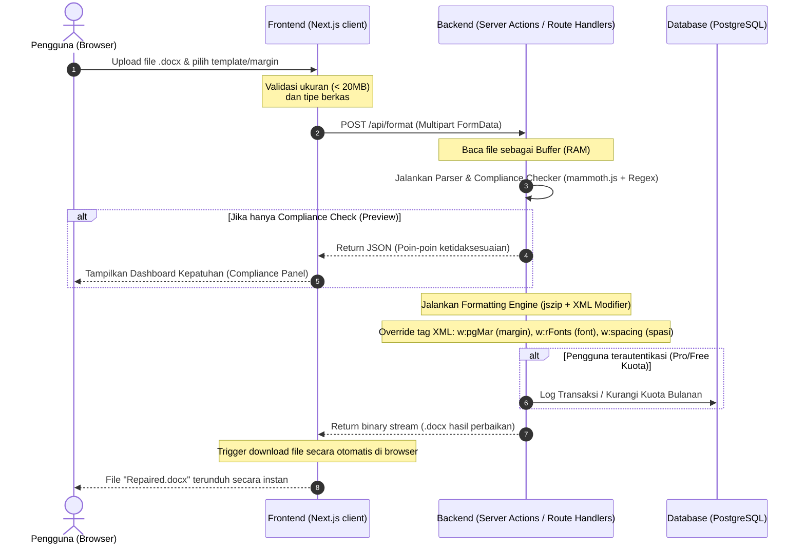

# Technical Requirement Document (TRD) - MVP V1.0
## Nama Produk: RapihinAI / ThesisFlow AI

---

## 1. System Architecture & Data Flow

Sistem dikembangkan menggunakan arsitektur full-stack modern Next.js. Pemrosesan berkas `.docx` dilakukan secara ephemeral di memori server tanpa penyimpanan jangka panjang pada disk (untuk pengguna reguler).

### Data Flow Diagram (Mermaid)



---

## 2. API Contract & Endpoints Specifications

### 2.1. Format & Standardize Document
* **Endpoint:** `POST /api/format`
* **Content-Type:** `multipart/form-data`
* **Request Payload:**
  * `file`: File Binary (Nama parameter: `file`, tipe: `.docx`, ukuran maksimal 20MB)
  * `templateId`: String (ID template dari preset, e.g., `"standard"` atau `"custom"`)
  * `customMarginTop`: String/Float (Opsional, dalam cm, e.g., `4.0`)
  * `customMarginBottom`: String/Float (Opsional, dalam cm, e.g., `3.0`)
  * `customMarginLeft`: String/Float (Opsional, dalam cm, e.g., `4.0`)
  * `customMarginRight`: String/Float (Opsional, dalam cm, e.g., `3.0`)
  * `fontFamily`: String (Opsional, e.g., `"Times New Roman"`. Catatan: font selain Times New Roman memerlukan akun Pro)
  * `fontSize`: String/Int (Opsional, e.g., `12`)
  * `lineSpacing`: String/Float (Opsional, e.g., `1.5`, `2.0`)

* **Response (Success - Binary File Download):**
  * **Status:** `200 OK`
  * **Headers:**
    * `Content-Type: application/vnd.openxmlformats-officedocument.wordprocessingml.document`
    * `Content-Disposition: attachment; filename="Repaired_Thesis.docx"`
  * **Body:** Stream data binary `.docx` hasil manipulasi XML.

* **Response (Error / Format Gagal):**
  * **Status:** `400 Bad Request` atau `500 Internal Server Error`
  * **Content-Type:** `application/json`
  * **Body:**
    ```json
    {
      "success": false,
      "errorCode": "INVALID_FILE_FORMAT",
      "message": "Berkas yang diunggah harus memiliki format .docx asli.",
      "details": null
    }
    ```

### 2.2. Get Document Templates (Preset List)
* **Endpoint:** `GET /api/templates`
* **Content-Type:** `application/json`
* **Response (Success):**
  * **Status:** `200 OK`
  * **Body:**
    ```json
    {
      "success": true,
      "data": [
        {
          "id": "standard",
          "name": "Template Standar Akademik (General)",
          "margins": { "top": 4, "bottom": 3, "left": 4, "right": 3 },
          "primaryFont": "Times New Roman",
          "primaryFontSize": 12,
          "lineSpacing": 1.5
        }
      ]
    }
    ```

---

## 3. Database Schema (Prisma ORM & PostgreSQL)

Database digunakan terutama untuk keperluan analitik KPI, otorisasi pengguna (tingkatan akun Free vs Pro), manajemen kuota, dan pencatatan audit log penggunaan template untuk dasbor pengelola.

```prisma
datasource db {
  provider = "postgresql"
  url      = env("DATABASE_URL")
}

generator client {
  provider = "prisma-client-js"
}

enum UserTier {
  FREE
  PRO
}

model User {
  id           String     @id @default(uuid())
  email        String     @unique
  name         String?
  tier         UserTier   @default(FREE)
  createdAt    DateTime   @default(now())
  updatedAt    DateTime   @updatedAt
  
  // Kuota Upload bulanan (misal: Free 2x per bulan)
  uploadLimit  Int        @default(2)
  uploadUsed   Int        @default(0)
  resetDate    DateTime   // Tanggal reset kuota bulanan
  
  activities   Activity[]
}

model Activity {
  id         String   @id @default(uuid())
  userId     String
  user       User     @relation(fields: [userId], references: [id], onDelete: Cascade)
  templateId String   // Template yang digunakan (e.g. "standard", "custom")
  fileSize   Int      // Ukuran berkas dalam bytes
  durationMs Int      // Durasi pemrosesan di server dalam milidetik
  status     String   // "SUCCESS" atau "FAILED"
  createdAt  DateTime @default(now())

  @@index([userId])
  @@index([createdAt])
}
```

---

## 4. Core Logic & Library Specifications

### 4.1. Library Dependency List
* **`mammoth`** (`npm i mammoth`): Digunakan khusus untuk mengekstrak teks mentah (raw text) dari berkas `.docx` dengan performa tinggi. Ekstraksi teks ini diperlukan untuk melakukan pencocokan struktur dokumen (Bab & Sub-Bab) menggunakan *Regex*.
* **`jszip`** (`npm i jszip`): Digunakan untuk membongkar (unzip) berkas `.docx` (karena berkas `.docx` pada dasarnya adalah arsip ZIP yang berisi dokumen-dokumen XML) di dalam memori, memanipulasi file XML di dalamnya, dan mengepaknya kembali menjadi `.docx` valid.
* **`fast-xml-parser`** atau **`xmldom`** (`npm i xmldom`): Digunakan sebagai DOM parser untuk mencari dan mengubah elemen-elemen XML WordprocessingML secara aman.

### 4.2. Algoritma Kepatuhan & Manipulasi XML (Core Engine)
1. **Unzipping berkas `.docx`:** 
   - Membaca buffer biner dari *request* menggunakan `jszip`.
   - Mengambil file utama `word/document.xml`.
2. **Ekstraksi & Analisis Teks (Regex Matching):**
   - Jalankan `mammoth` untuk mengekstrak teks mentah guna mendeteksi keberadaan:
     - Bab Utama: `/\b(BAB\s+[IVXLCDM]+)\b/i`
     - Sub-bab: `/^([1-9]\.[0-9]+)\s+([A-Za-z\s]+)/m`
     - Daftar Pustaka: `/\b(Daftar\s+Pustaka|Referensi|Bibliography)\b/i`
3. **Manipulasi Node XML (`word/document.xml` & `word/styles.xml`):**
   - **Margins (Page Margin):**
     Cari tag `<w:pgMar>` di dalam XML bagian `<w:sectPr>` (Section Properties).
     Rumus konversi cm ke unit Word (Twips: $1\text{ cm} = 567\text{ twips}$):
     $$\text{twips} = \text{cm} \times 567$$
     Ubah atribut:
     - `w:top`, `w:bottom`, `w:left`, `w:right` sesuai konversi twips di atas.
   - **Font Override:**
     Ubah deklarasi font pada tag `<w:rFonts>` di dalam objek Run Properties (`<w:rPr>`) di dalam dokumen dan style utama (`word/styles.xml`):
     - Ubah `w:ascii` dan `w:hAnsi` menjadi font target (e.g., `Times New Roman`).
   - **Spasi Baris (Line Spacing):**
     Ubah tag `<w:spacing>` pada objek Paragraph Properties (`<w:pPr>`):
     - Ubah atribut `w:line` dan `w:lineRule` (e.g., $1.5\text{ spasi} = 360$ unit, $2.0\text{ spasi} = 240$ unit jika auto).

### 4.3. Batasan Teknis & System Constraints
* **Maksimum Ukuran Berkas:** 20MB. Berkas di atas limit akan otomatis ditolak di tingkat Route Handler sebelum diproses (mencegah *Out-of-Memory* pada serverless platform).
* **Execution Timeout:** Maksimal 30 detik. Proses reparasi harus diselesaikan dalam rentang waktu tersebut untuk mencegah pemutusan koneksi serverless.

---

## 5. Data Privacy & Security Guardrails

Karena berkas skripsi/tesis bersifat sensitif dan rahasia sebelum dipublikasikan, pengamanan data diprioritaskan dengan aturan ketat:

1. **Pemrosesan Ephemeral (In-Memory Buffer):**
   - Berkas `.docx` yang diunggah dikonversi menjadi buffer di memori RAM dan dimanipulasi langsung di memori menggunakan `jszip`.
   - **Tidak ada berkas yang ditulis ke dalam penyimpanan fisik (*Hard Disk*) lokal server** atau penyimpanan awan (*Cloud Object Storage* seperti S3/GCS) selama pemrosesan.
2. **Garbage Collection & Memory Deallocation:**
   - Setelah berkas hasil perbaikan dikirim kembali sebagai HTTP binary response, variabel buffer langsung di-set ke `null` atau dibiarkan masuk ke mekanisme *garbage collection* Node.js secara otomatis.
3. **Data Transit Security:**
   - Seluruh proses komunikasi data antara client dan server wajib dienkripsi menggunakan protokol **HTTPS (SSL/TLS 1.3)**.
4. **Isolasi Log Identifikasi:**
   - Log aplikasi di server (seperti CloudWatch atau Vercel logs) tidak boleh mencatat nama berkas asli, isi dokumen, maupun informasi pribadi sensitif pengguna. Hanya metrik ukuran berkas (bytes) dan waktu pemrosesan yang dicatat untuk kebutuhan pemantauan performa sistem.

---

## 6. Folder Structure (Layered Architecture)

Untuk memastikan kode terkelompok dengan baik berdasarkan tanggung jawabnya (Separation of Concerns), proyek ini menggunakan struktur folder berlapis (*layered architecture*):

```text
rapihin-ai/
├── app/                        # Next.js App Router (Routing & Pages)
│   ├── api/                    # API Route Handlers
│   │   ├── format/
│   │   │   └── route.ts        # POST /api/format
│   │   └── templates/
│   │       └── route.ts        # GET /api/templates
│   ├── layout.tsx              # Root Layout
│   └── page.tsx                # Landing & Upload Page
├── components/                 # Global & Shared UI (Presentational Components)
│   ├── ui/                     # Shadcn UI (Atomic components: Button, Card, Dialog, etc.)
│   ├── shared/                 # Shared layouts (Header, Footer, Sidebar)
│   └── providers.tsx           # Global app providers (React Query, etc.)
├── features/                   # Self-Contained Domain Features (Root-level Features)
│   └── formatter/              # Feature domain for document formatting
│       ├── components/         # Feature-specific components
│       │   ├── Dropzone.tsx        # Upload area ala AirDrop
│       │   ├── CompliancePanel.tsx # Dashboard laporan ketidaksesuaian format
│       │   ├── TemplateSelector.tsx# Form/Pemilih template kampus
│       │   ├── ProcessingModal.tsx # Fullscreen loading modal
│       │   └── Pricing.tsx         # Pricing plans section
│       ├── actions/            # Feature-specific server actions or API utilities
│       └── repository/         # Feature-specific database queries/repositories
├── services/                   # Business Logic Layer (Otak Aplikasi/Core Engine)
│   ├── parser/
│   │   └── compliance.ts       # Deteksi Bab/Sub-bab (mammoth.js + Regex)
│   ├── formatter/
│   │   ├── docx-formatter.ts   # Manipulasi XML (jszip + w:pgMar/w:rFonts overrides)
│   │   └── units.ts            # Utilitas konversi unit (e.g., cm to twips)
│   └── db/
│       └── quota.ts            # Pengecekan & pembaruan kuota upload pengguna di PostgreSQL
├── hooks/                      # Custom React Hooks (State & Async Fetching)
│   ├── useTemplates.ts         # GET /api/templates menggunakan React Query
│   └── useFormatDocument.ts    # Mutation POST /api/format menggunakan React Query
├── lib/                        # Global Libraries Initialization & Config
│   ├── prisma.ts               # Prisma Client Singleton instance
│   └── query-client.ts         # QueryClient config (React Query)
├── prisma/                     # Database Schema & Migrations
│   └── schema.prisma           # Skema Prisma untuk PostgreSQL
├── types/                      # TypeScript Types & Interfaces
│   ├── index.ts                # Global type exports
│   └── document.ts             # Definisi tipe berkas, hasil compliance, & config template
├── docs/                       # Dokumentasi Proyek
│   ├── PRD.md
│   ├── TRD.md                  # Dokumen Persyaratan Teknis (File ini)
│   ├── DESIGN.md               # Panduan Desain & UI/UX
│   └── prd-visual.html         # Visual PRD interaktif
├── package.json
└── tsconfig.json
```

