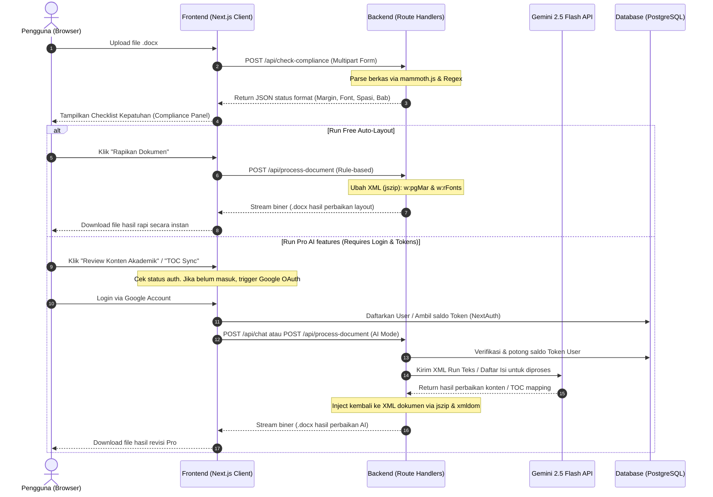

# Technical Requirement Document (TRD) - RapihinAI MVP

---

## 1. System Architecture & Data Flow

Sistem dikembangkan menggunakan arsitektur full-stack modern Next.js. Pemrosesan berkas `.docx` dilakukan secara ephemeral di memori server tanpa penyimpanan jangka panjang pada disk (untuk keamanan & privasi data pengguna).

### Data Flow Diagram (Mermaid)



---

## 2. API Contract & Endpoints Specifications

### 2.1. Check Document Compliance
* **Endpoint:** `POST /api/check-compliance`
* **Content-Type:** `multipart/form-data`
* **Request Payload:**
  * `file`: File Binary (docx, max 20MB)
  * `config`: Stringified JSON (e.g., `{"id":"standard","fontFamily":"Times New Roman","fontSize":12,"lineSpacing":1.5}`)
* **Response (Success - JSON):**
  * **Status:** `200 OK`
  * **Body:**
    ```json
    {
      "overallStatus": "needs_revision",
      "issueCount": 3,
      "items": [
        {
          "id": "margin",
          "label": "Batas Margin Halaman",
          "status": "warning",
          "detected": "Kiri 3cm, Kanan 3cm, Atas 3cm, Bawah 3cm",
          "expected": "Kiri 4cm, Kanan 3cm, Atas 4cm, Bawah 3cm",
          "desc": "Dokumen Anda menggunakan margin default. Kami akan menyesuaikan ukurannya."
        }
      ]
    }
    ```

### 2.2. Auto-Format & AI Document Processing
* **Endpoint:** `POST /api/process-document`
* **Content-Type:** `multipart/form-data`
* **Request Payload:**
  * `file`: File Binary (docx, max 20MB)
  * `config`: Stringified JSON template settings
  * `mode`: String (`"layout"` untuk gratis, `"ai_review"` atau `"toc_sync"` untuk Pro)
* **Response (Success - Binary File Download):**
  * **Status:** `200 OK`
  * **Headers:**
    * `Content-Type: application/vnd.openxmlformats-officedocument.wordprocessingml.document`
    * `Content-Disposition: attachment; filename="RapihinAI_Hasil.docx"`
  * **Body:** Stream data binary `.docx` hasil manipulasi XML.

### 2.3. AI Chat Assistance & Context (Gemini 2.5 Flash)
* **Endpoint:** `POST /api/chat`
* **Content-Type:** `application/json`
* **Request Payload:**
  * `messages`: Array of chat messages
  * `fileContext`: Object (Optional, context file details)
* **Response:** Server-Sent Events (SSE) stream returning markdown text generated by Gemini.

---

## 3. Database Schema (Prisma ORM & PostgreSQL)

Database menggunakan skema **NextAuth.js standard** yang diperluas untuk mencatat saldo **Token** pengguna dan histori telemetry.

```prisma
datasource db {
  provider = "postgresql"
  url      = env("DATABASE_URL")
}

generator client {
  provider = "prisma-client-js"
}

// NextAuth.js Standard Models
model Account {
  id                String  @id @default(cuid())
  userId            String
  type              String
  provider          String
  providerAccountId String
  refresh_token     String? @db.Text
  access_token      String? @db.Text
  expires_at        Int?
  token_type        String?
  scope             String?
  id_token          String? @db.Text
  session_state     String?

  user User @relation(fields: [userId], references: [id], onDelete: Cascade)

  @@unique([provider, providerAccountId])
}

model Session {
  id           String   @id @default(cuid())
  sessionToken String   @unique
  userId       String
  expires      DateTime
  user         User     @relation(fields: [userId], references: [id], onDelete: Cascade)
}

model User {
  id            String    @id @default(cuid())
  name          String?
  email         String?   @unique
  emailVerified DateTime?
  image         String?
  accounts      Account[]
  sessions      Session[]

  // Custom RapihinAI Fields
  tokens        Int       @default(5) // Saldo token awal gratis
  createdAt     DateTime  @default(now())
  updatedAt     DateTime  @updatedAt

  activities    Activity[]
}

model VerificationToken {
  identifier String
  token      String   @unique
  expires    DateTime

  @@unique([identifier, token])
}

// Logging & Telemetry
model Activity {
  id         String   @id @default(cuid())
  userId     String
  user       User     @relation(fields: [userId], references: [id], onDelete: Cascade)
  actionType String   // "LAYOUT_FIX", "AI_REVIEW", "TOC_SYNC", "TOP_UP"
  tokenCost  Int      @default(0)
  fileSize   Int?     // bytes
  durationMs Int?
  status     String   // "SUCCESS", "FAILED"
  createdAt  DateTime @default(now())

  @@index([userId])
}
```

---

## 4. Core Logic & Library Specifications

### 4.1. Library Dependency List
* **`next-auth`**: Autentikasi Google OAuth secara native di Next.js.
* **`ai` & `@ai-sdk/google`**: SDK Vercel AI untuk memanggil model `gemini-2.5-flash` dengan performa stream tinggi.
* **`jszip`**: Ekstraksi dan pengemasan kembali file `.docx` XML in-memory.
* **`xmldom`**: Parsing string XML ke objek DOM untuk manipulasi node-node Word (`w:r`, `w:p`, dsb).

### 4.2. XML Preservation Engine (AI Text Editing)
Tantangan terbesar mengedit dokumen Word menggunakan AI adalah menjaga agar gaya pemformatan (seperti teks *bold*, *italic*, pewarnaan, dan hyperlink) tidak hilang setelah teks diganti oleh AI.
* **Solusi Per-Run Element:**
  Sistem tidak mengirimkan file XML mentah langsung ke AI. Sebaliknya:
  1. File `word/document.xml` dibongkar.
  2. Sistem membaca tag paragraf `<w:p>`. Di dalam paragraf terdapat sub-elemen run `<w:r>` yang membungkus teks `<w:t>`.
  3. Sistem hanya mengekstrak konten teks murni untuk direview oleh AI.
  4. AI mengembalikan teks hasil revisi beserta peta perubahan (*diff mapping*).
  5. Sistem mengganti konten di dalam tag `<w:t>` secara selektif dengan mempertahankan pembungkus gaya `<w:rPr>` (Run Properties) aslinya.

### 4.3. Table of Contents (TOC) Synchronizer Logic
TOC Microsoft Word menggunakan *fields* XML khusus (`INSTR "TOC \o '1-3' \h \z \u"`).
* **Solusi Singkronisasi:**
  1. Sistem melakukan pemindaian halaman di memori untuk menghitung estimasi tinggi konten berdasarkan jumlah karakter per halaman (asumsi standard $300\text{ kata} \approx 1\text{ halaman}$ pada margin 4-3-4-3).
  2. Mendeteksi lokasi header Bab (`BAB I`, `BAB II`) dan Sub-bab.
  3. Memperbarui field nomor halaman pada entri Daftar Isi di dalam XML menggunakan parser DOM, menyamakan nomor halaman hasil estimasi dengan entri di tabel TOC.
